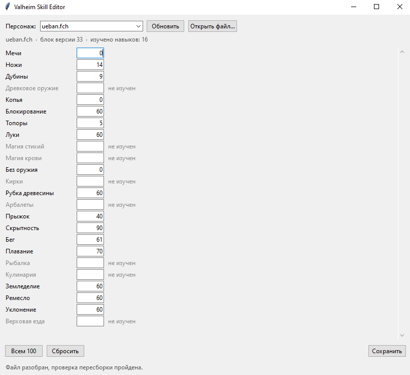

# Valheim Skill Editor

Редактор навыков персонажей Valheim. Открывает файл сохранения `.fch`,
показывает все 24 навыка и позволяет выставить любой уровень — включая те
навыки, которые персонаж ещё не изучал.

Программа не меняет ничего, кроме навыков: инвентарь, рецепты, статистика,
внешность и постройки сохраняются байт в байт.

*English: a skill editor for Valheim character saves. Interface is in Russian.*



## Установка

Скачай `ValheimSkillEditor.zip` из
[последнего релиза](../../releases/latest), распакуй и запусти
`ValheimSkillEditor.exe`. Python не нужен.

Если предпочитаешь запускать из исходников:

```
git clone https://github.com/Borelko/valheim-skill-editor
cd valheim-skill-editor
python -m valheim_skills
```

Нужен Python 3.9 или новее. Сторонних библиотек нет.

## Как пользоваться

1. **Закрой Valheim полностью.** Игра держит персонажа в памяти и перезапишет
   файл при выходе, так что правка, сделанная при запущенной игре, пропадёт.
2. Запусти программу. Персонажи находятся автоматически в
   `%USERPROFILE%\AppData\LocalLow\IronGate\Valheim\characters_local`.
3. Выбери персонажа, впиши нужные уровни, нажми «Сохранить».

Изученные навыки показаны чёрным, неизученные — серым с пустым полем. Чтобы
добавить навык, впиши в его поле число.

Копия оригинала создаётся автоматически, рядом с файлом, с отметкой времени в
имени. Если что-то пойдёт не так, переименуй копию обратно.

## Консольный режим

```
python -m valheim_skills --cli                          меню в консоли
python -m valheim_skills --list-skills                  таблица навыков
python -m valheim_skills Ragnar.fch --set-skill 102=50 --in-place
python -m valheim_skills Ragnar.fch --set-all 100 --out Ragnar_max.fch
python -m valheim_skills Ragnar.fch --add-missing 25 --in-place
python -m valheim_skills A.fch --diff B.fch             сравнить навыки
```

У собранного exe те же ключи: без аргументов открывается окно, с аргументами
работает консоль.

## Навыки и их номера

| id | Навык | id | Навык |
|----|-------|----|-------|
| 1 | Мечи | 13 | Рубка древесины |
| 2 | Ножи | 14 | Арбалеты |
| 3 | Дубины | 100 | Прыжок |
| 4 | Древковое оружие | 101 | Скрытность |
| 5 | Копья | 102 | Бег |
| 6 | Блокирование | 103 | Плавание |
| 7 | Топоры | 104 | Рыбалка |
| 8 | Луки | 105 | Кулинария |
| 9 | Магия стихий | 106 | Земледелие |
| 10 | Магия крови | 107 | Ремесло |
| 11 | Без оружия | 108 | Уклонение |
| 12 | Кирки | 110 | Верховая езда |

Номера 9 и 10 не совпадают с таблицей, которая ходит по интернету: там магия
крови стоит на 9. Все названия здесь установлены сравнением значений из файла
с окном навыков в игре на трёх персонажах.

## Устройство формата `.fch`

Внешний слой — контейнер: длина, полезные данные, длина, SHA512 от данных.
Если хеш не сойдётся, игра откажется загружать персонажа, поэтому он
пересчитывается при каждой записи.

Внутри профиль версии 46: массив из 205 чисел со статистикой, цепочка
словарей (время в мирах, модификаторы сложности, убитые существа, собранные
ресурсы), а последним полем — блок персонажа версии 33.

В блоке разбираются рецепты, станки, материалы, подсказки, трофеи, биомы,
тексты, внешность, съеденная еда и навыки. Инвентарь лежит в голове блока,
известные постройки — в хвосте; эти куски программа не трогает и копирует
как есть.

Числа записаны в прямом порядке байтов, строки — с длиной в формате 7-битных
групп и текстом в UTF-8, как это делает `BinaryWriter` в C#. Имена предметов
в инвентаре хранятся не строками, а целочисленным хешем имени префаба.

## Почему это безопасно

Перед каждой записью программа собирает файл заново из разобранных структур и
сравнивает с оригиналом побайтово. Если совпадения нет, сохранение
отменяется: значит, формат понят не полностью, и запись могла бы повредить
персонажа.

Всё, что программа не разбирает, хранится сырыми байтами и переносится в
новый файл без изменений. Поэтому правка уровня меняет ровно четыре байта, а
добавление навыка увеличивает файл ровно на двенадцать.

## Если файл не открылся

Скорее всего, вышел патч игры и формат изменился. Создай
[issue](../../issues/new/choose) и приложи файл персонажа — формат
восстанавливается за несколько итераций.

Учти, что в `.fch` записан идентификатор игрока. Если не хочешь им делиться,
напиши об этом в issue, разберёмся по выводу программы.

## Разработка

```
pip install -e ".[dev]"
pytest
```

Тесты работают на синтетических файлах, которые генерируются на лету —
настоящие сохранения в репозиторий не попадают.

Код разделён на ядро и интерфейсы: `core.py` занимается только форматом и
ничего не печатает, `cli.py` и `gui.py` — только общением с человеком.

## Лицензия

MIT. Пользуйся, форкай, переделывай.
